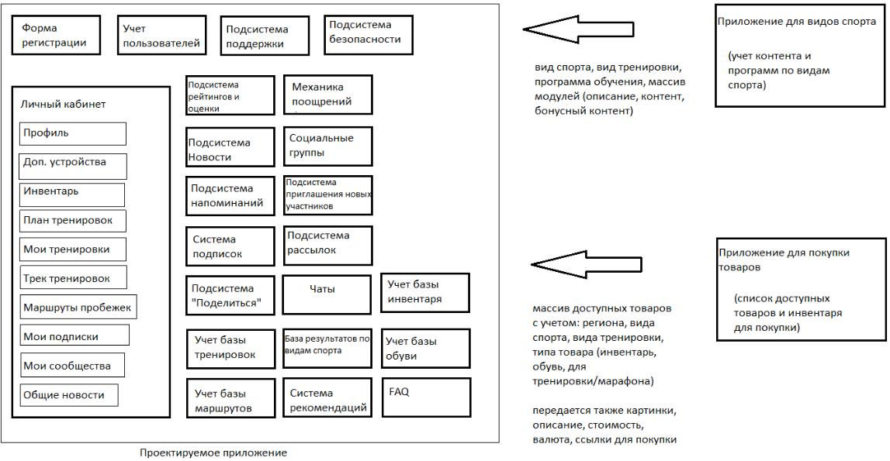

# Выпускная дипломная работа по курсу "Архитектор программного обеспечения" на Skillbox
Ссылка на курс: https://go.skillbox.ru/education/course/software-architect

## Содержание работы
- [Бизнес-цели](#бизнес-цели)
- [Функциональные требования](#функциональные-требования)
- [Стейкхолдеры и их интересы](#стейкхолдеры-и-их-интересы)
- [Концептуальная архитектура (модель)](#концептуальная-архитектура)
- [Риски реализации](#риски-реализации)
- [План поэтапной разработки и расширения системы](#план-поэтапной-разработки-и-расширения-системы)
- [Критические бизнес-сценарии](#критические-бизнес-сценарии)
- [Атрибуты качества](#атрибуты-качества)
- [Нефункциональные требования](#нефункциональные-требования)
- [Анализ и описание архитектурных опций и обоснование выбора](#анализ-и-описание-архитектурных-опций-и-обоснование-выбора)

## Бизнес-цели

1. Повышение узнаваемости и лояльности бренда компании.
   - Реализовать эффективную социальную составляющую с формированием групп по интересам и повышением вовлеченности пользователей в общение
   - Интегрировать промо-материалы компании и ее продукции в зависимости от типа тренировок пользователей
2. Увеличение объемов продаж товаров компании.
   - Предоставлять рекомендации по подбору и обновлению спортивного инвентаря исходя из данных о тренировках
   - Обеспечить удобную интеграцию с существующими магазинами компании для онлайн-покупок
3. Повышение уровня физической активности населения.
   - Стимулировать сопоставление результатов тренировок и личностный прогресс с помощью геймификации и соревновательных элементов
   - Формирование групп для совместных тренировок для повышения мотивации
4. Расширение функциональных возможностей для разных категорий пользователей.
   - Обеспечить совместимость с различными внешними устройствами мониторинга.

## Функциональные требования

1. Необходимо предусмотреть регистрацию пользователя
   - 1.1. Онбординг регистрация при установке приложения
   - 1.2. Заполнение профиля пользователя
      - 1.2.1. Указание ФИО
      - 1.2.2. Возраста
      - 1.2.3. Страны и Региона
      - 1.2.4. Контакты (Телефон, Email)
      - 1.2.5. Уточнение интересов
         - 1.2.5.1 Хочу начать заниматься спортом (фиксируем любительский вид тренировок)
            - Уточнение вида спорта
         - 1.2.5.2. Уже занимаюсь спортом с друзьями
            - Уточнение вида спорта
               - Уточнение сколько по времени занимается
               - Занимаюсь спортом меньше года (фиксируем любительский вид тренировок)
               - Занимаюсь не более двух лет (фиксируем любительский вид тренировок)
               - Занимаюсь не более пяти лет (фиксируем начальный профессиональный вид тренировок)
               - Занимаюсь более пяти лет (фиксируем профессиональный вид тренировок)
2. Необходимо предусмотреть личный кабинет пользователя
   - 2.1. Возможность настройки Профиля (при регистрации параметры указываются)
      - 2.1.1. Возможность подключения своего телефона с фитнес функцией
      - 2.1.2. Возможность подключения своих часов с фитнес функцией
   - 2.2. Возможность указания своего инвентаря (обувь с датой когда примерно купили, снаряды) – используется для подсказок по составлению тренировок или обновления обуви
   - 2.3. Возможность создания плана тренировок
   - 2.4. Возможность напоминания по времени и датам тренировок
   - 2.5. Возможность публикации информации по своей тренировке
      - 2.5.1. Для бега отслеживание трека, скорости, общего длительности в км
   - 
   - 2.6. Возможность подписки на новости региона (если будут планироваться марафоны/совместные тренировки/занятия)
   - 2.7. Возможность подписки на новости и  акции по товарам компании
   - 2.8. Возможность подписки на новости вида спорта
   - 2.9. Возможность подписки на стримы тренировок
   - 2.10. Возможность поделиться маршрутом своей пробежки с сообществом
      - 2.10.1. Сохранение гео данных, времени пробежки, длительности, вида тренировки, время выполнения пробежки
      - 2.10.2. Возможность пометки маршрута (хороший вид/ малолюдно / нет собак)
   - 2.11. Возможность выбора маршрута пробежки в регионе по параметрам (из базы, что пользователи другие предложили), возможность просмотра отзывов и рейтингов, возможность фильтрации/поиска
   - 2.12. Возможность подписаться на новости спорта
   - 2.13. Общая лента новостей
      - 2.13.1. Публикуются новости по новым опциям приложения и др
      - 2.13.2. Публикуются новости по открытым группам/марафонам/тренировкам в регионе пользователя
      - 2.13.3. Публикуются новости успехов участников, которыми они хотят поделиться со всеми
      - 2.13.4. Публикуются новости по новым маршрутам участников, которыми они хотят поделиться со всеми
      - 2.13.5. Публикуются новости по подключению новых участников с приветствием и предложением поприветствовать его других участников
3. Необходимо предусмотреть стримы тренировок (отдельно для любителей и профессионалов)
   - 3.1. Формирование контента по новостям спорта
   - 3.2. Формирование контента для самих тренировок
      - 3.2.1. Контент с видео уроками по тренировкам
      - 3.2.2. Контент с аудио уроками по тренировкам
      - 3.2.3. Контент на расслабление мышц и восстановление
      - 3.2.4 Контент на планирование тренировок, подготовку к тренировкам, завершение тренировок
      - 3.2.5. Контент по правильному питанию и питьевому режиму
      - 3.2.6. Контент по медитации, правильному дыханию
      - 3.2.7. Контент бонус, может быть выделен из любой группы контента, но не должен быть свободно доступен ни в треке, ни в общем доступе
   - 3.3. Формирование программ тренировок (последовательность набора контента)
      - 3.3.1. для разных видов тренировок (для любителей и профессионалов)
      - 3.3.2. для разных видов спорта (бег, йога, на улице/на площадке)
   - 3.4. Механика поощрения по прохождению программ тренировок
      - 3.4.1. В самом начале тренировок рассказать о том, что если пользователь все будет делать вовремя, то ему будут открываться дополнительные закрытые модули
      - 3.4.2. В самом начале тренировки спросить ради какой цели пользователь хочет заниматься (чтобы написал) и предложить согласиться напомнить ему эту цель, в случае, если будет пропускать тренировки
      - 3.4.3. Видео/аудио/ текстовая похвала за пройденный урок / за пройденный модуль
      - 3.4.4. В случае, если вовремя проходит – дополнительно хвалить и открывать доступ на доп. Модуль
      - 3.4.5. В случае если пропускает тренировки напоминание
         - 3.4.5.1. Если есть цель и согласие – напоминание цели (не чаще 1 раза, далее абстрактные напоминания)
         - 3.4.5.2. Если нет цели и согласия – то общее напоминание (не чаще раза в неделю)
   - 3.5. Формирование базы готовых маршрутов для пробежек/марафонов по регионам
      - 3.5.1. Сохранение маршрутов предложенных пользователями
      - 3.5.2. Возможность проставить звездочки и оставить отзыв
4. Необходимо реализовать формирование социальных групп по интересам
   - 4.1. Возможность создавать социальные группы (открытые/закрытые)
   - 4.2. Возможность приглашать участников из списка контактов
   - 4.3. Возможность приглашать участников ПО в социальную группу
      - 4.3.1. Указание параметров потенциальных участников (по виду спорта, по региону, «живут рядом» с указанием места планируемого марафона/тренировки/занятия)
      - 4.3.2. Указание текста приглашения в сообщество
      - 4.3.3. Рассылка потенциальным участникам приглашений для вступления в группу со ссылкой на вступление
   - 4.4. Возможность выбирать темы сообществ:
      - 4.4.1. По виду спорта (Бег/йога/на улице/на площадке)
      - 4.4.2. По виду активности (тренировка/марафон/совместное занятие)
5. Необходимо предусмотреть самоподдержку социальных групп
   - 5.1. При установке приложения предлагать предоставлять доступ к Контактам
   - 5.2. Делать рассылку, что пользователь присоединился к сообществу (в общей ленте новостей, ? контактам по емэйл)
   - 5.3. Возможность приглашать на марафон, тренировку, в группу – любого из списка своих Контактов
      - 5.3.1. Если контакт еще не зарегистрирован в приложении- присылать приглашение на смс/емэйл для регистрации и подключения
      - 5.3.2. Если контакт зарегистрирован в приложении – добавление в сообщество по марафону/тренировке/группы.
   - 5.4. Возможность делиться новостями из сообщества в соц.сетях с пометкой на источник
   - 5.5. Возможность делиться результатами тренировок в соц. Сетях с пометкой на источник
   - 5.6. Возможность делиться планами участия в марафоне и результатами марафона в соц. Сетях с пометкой на источник
6. Раздел поддержки, в котором:
   - 6.1. предусмотреть FAQ, возможность указать не точность/ошибку, возможность предложить улучшение ПО, задать вопрос
   - 6.2. чат со всеми участниками сообщества и с членами службы поддержки, чтобы отвечать на вопросы могли не только специалисты службы поддержки, но и сами участники
7. Необходимо предусмотреть возможность общаться
   - 7.1. Возможность создания открытых/закрытых чатов
   - 7.2. Возможность написать в мессенджере
8. Необходимо предусмотреть возможность влиять друг на другу
   - 8.1. Возможность сравнения своих результатов тренировки
      - 8.1.1. Своих результатов со своими предыдущими (приоритетный вариант)
      - 8.1.2. Своих результатов со средними результатами пользователей того же региона
      - 8.1.3. Своих результатов со средними результатами пользователей по такому же виду тренировок
      - 8.1.4. Своих результатов со средними результатами пользователей профессионалов (профессионалы по виду треннировок)
   - 8.2. Возможность приглашать друзей и знакомых на тренировки/марафоны/занятия
9. Необходимо формирование образа бренда
   - 9.1. Предусмотреть возможность рекомендаций в личном кабинете пользователя
      - 9.1.1. Если в стране/регионе пользователя есть сезоны дождей/снегов, а обуви в инвентаре пользователя соответствующей нет – перед или во время сезона предлагать обувь фирмы с доставкой
      - 9.1.2 Если добавлен новый вид спорта, а обувь для вида спорта в инвентаре пользователя не предусмотрена - предлагать необходимую обувь фирмы с доставкой
      - 9.1.3. Если срок спортивной обуви, указанный в инвентаре пользователя, подходит к концу - предлагать необходимую обувь фирмы с доставкой
      - 9.1.4. Предусмотреть риск переинформирования/спама пользователя – проработка стратегии ненавязчивого информирования
   - 9.2. Предусмотреть возможность публикации полезных статей/видео с рекламой бренда для любителей и профессиональных спортсменов
      - 9.2.1. Для каждой статьи/видео предусмотреть рекомендации полезных в рамках статьи товаров/инвентаря с дальнейшей продажей
      - 9.2.2. Статьи/видео необходимо публиковать раз в день:
         - 9.2.2.1. В личном кабинете в разделе Рекомендации для вас
            - 9.2.2.1.1. С учетом типы пользователя (мужчина, женщина, средний чек покупки, возраст)
            - 9.2.2.1.2. С учетом вида тренировок (любительские, профессиональные)
         - 9.2.2.2. В сообществах - в зависимости от тематик сообщества
            - 9.2.2.2.1. С учетом типов пользователей в сообществе
            - 9.2.2.2.2. С учетом тематик сообществ
            - 9.2.2.2.3. С учетом вида тренировок (любительские, профессиональные)
     - 9.2.3. В разделе Полезные лайф хаки (образовательный раздел в виде библиотеки, доступен любому пользователю)
        - 9.2.3.1. С учетом региона пользователя
        - 9.2.3.2. С учетом вида тренировок (любительские, профессиональные)
10. Необходимо предусмотреть роли:
   - 10.1. Пользователь
   - 10.2. Контент менеджер
   - 10.3. Модератор
   - 10.4. Системный администратор
11. Необходимо предусмотреть интеграцию информационных систем
   - 11.1. Интеграция МП с телефонными контактами устройства
   - 11.2. Интеграция МП с приложениями для видов спорта
   - 11.3. Интеграция МП с приложениями для покупки товаров
   - 11.4. Интеграция МП с картами регионов для фиксации маршрутов
   - 11.5. Интеграция МП с приложениями доп. Устройств
      - 11.5.1. Фитнес функция телефона
      - 11.5.2. Apl watch и аналоги
12. Необходимо предусмотреть обеспечение безопасности
   - 12.1. Хранение персональных и чувствительных данных в закрытом контуре
   - 12.2. Шифрование/маскирование при передаче и использовании данных. В т.ч. шифрование с ассимитричными ключамиили хэширование с использованием динамической соли.
   - 12.3. SDCT/ DLP
   - 12.4. DDOS  для защиты от аттак
   - 12.5. Антивирусная защита
   - 12.6. Дополнительный мониторинг для выявления сетевых анамалий NBA
   - 12.7 Модуль антиспам и антимат для коммуникаций в сообществах и чатах
   - 12.8. При интеграции с приложениями по видам спорта и приложениями для покупки товаров предусмотреть доп. авторизацию приложений
   - 12.9. Многофакторная аутентификация пользователей (MFA)
   - 12.10. Дополнительная авторизация при интеграции систем
   - 12.11. Использование при работе с кросс приложениями OAuth
   - 12.12. Использование федеративной идентификации (FIM)
   - 12.13. Необходимо предусмотреть разграничение доступа по ролям пользователей к данным
   - 12.14. Подсистема мониторинга
      - 12.14.1. RED метод сбора метрик (rate - количество запросов в сек, errors- количество ошибок (при интеграции между системами, системных, пользовательских), duration- время запроса)
      - 12.14.2. Latency - время ответа сервисов при интеграционных взаимодействиях
      - 12.14.3. бизнес метрики (количество сообществ, количество активных сообществ, количество уникальных пользователей, DAU, MAU, WAU, количество показов рекламных статей, количество продаж после показов, retention пользователей, прирост пользователей в день)
   - 12.15. Администратор контента
      - 12.15.1. Система, аккумулирующая всю переписку во всех чатах и сообществах
         - 12.15.1.1. Сотрудник, отвечающий за разметку контента
         - 12.15.1.2. AI для отслеживания контента
            - 12.15.1.2.1. Отслеживает информацию о конкурентах
            - 12.15.1.2.2. Отслеживает информацию о фирме, собственных товарах
            - 12.15.1.2.3. Отслеживает информацию о новых запросах по видам спорта
      - 12.15.2. Сотрудник, передающий информацию в отдел качества по товарам конкурентов, фирме, собственным товарам
      - 12.15.3. Сотрудники, отвечающие на жалобы на товар в открытых сообществах/чатах, отвечающие на вопросы по фирме

## Стейкхолдеры и их интересы
1. Руководитель отдела продаж
   - Заинтересован в дополнительной возможности продажи товаров/инвентаря.
   - Знает текущую Целевую аудиторию, интересы, топовые товары.
   - Знает специфику по регионам
   - Владелец и заказчик ИС по учету товаров/инвентаря в регионах, условиям доставки, стоимости и тд.
   - Владеет ресурсами по наличию и описанию товаров
2. Руководитель отдела маркетинга
   - Заинтересован в дополнительном канале по рекламе продукции
   - Знает Целевую аудиторию и особенности позиционирования товара по регионам
   - Знает особенности Клиентов с учетом используемых устройств и приложений
   - Владелец и исполнитель по красивому описанию товаров/инвентаря
   - Владеет ресурсами для продвижения приложения и для описания новостей и тп внутри приложения
3. Руководитель отдела ИТ (разработка, инфраструктура, безопасность, сопровождение)
   - Заинтересован в реализации единого архитектурного решения. Разрозненными решениями сложнее управлять. В случае успешности проекта – скорее всего будет премия.
   - Заинтересован в безопасном решении, чтобы потом не было форс мажоров
   - Владеет информацией по текущим существующим ИС (приложения для видов спорта, приложения для покупки товаров) – функциональное наполнение, на чем реализовано, какая БД и тд
   - Владеет контактами для постановки задачи по доработкам существующих ИС и дальнейшей интеграции с ними
   - Владеет ресурсами по инфраструктуре, владеет ресурсами по разработке
4. Руководитель отдела по работе с клиентами
   - Заинтересован, чтобы Клиенты были довольны и было минимальное количество жалоб
   - Владеет информацией по текущим запросам клиентов, текущим потребностям по регионам
   - Владеет ресурсами по улучшению качества продукта
5. Генеральный директор
   - Заинтересован в увеличении узнаваемости бренда, в увеличении продаж
   - Владеет полномочиями, чтобы запустить проект и реализовать его.

## Концептуальная архитектура

## Риски реализации
1. Риск утери персональных данных
2. Риск плохого качества продукта
3. Риск не соответствия целевой аудитории
   - Необходимо продумать механику отслеживания профиля наших пользователей и их интересов
   - Мониторинг и контроль соответствия продукта ожиданиям и потребностям пользователей
4. Риск, что приложение никто не будет скачивать
   - Необходимо продумать каналы и способы продвижения
   - Необходимо продумать систему мониторинга и отслеживания эффективности каналов распространения
   - Необходимо продумать стратегию и контент по маркетингу
5. Риск переинформирования/спама пользователя – проработка стратегии ненавязчивого информирования
6. Риск, что пользователю не понравится приложение и не будет пользоваться – проработка риска
   - Обзвон пользователей, установивших программу и не пользующихся ею в течение 7 дней после установки
   - Выделение отдельной команды по работе с мониторингом пользователей и увеличению воронки

## План поэтапной разработки и расширения системы
1. Стадия 1. Организация проекта
   - Этапы:
      - Заключение контракта
      - Согласование процедур управления
      - Сбор команды проекта
      - Обучение членов проектной команды
2. Стадия 2. Формирование требований и разработка технического задания
   - Этапы:
      - Системно-аналитическое обследование объекта автоматизации
      - Анализ и обработка полученной информации
      - Разработка концептуальной модели данных
      - Разработка технического задания
      - Согласование и утверждение
3. Стадия 3. Эскизный проект
   - Этапы:
      - Определение общей функциональной и технической архитектур
      - Разработка логической модели данных
      - Обоснование выбора программного обеспечения и технической инфраструктуры
      - Разработка предварительного регламента взаимодействия информационных систем
      - Эскизное проектирование
      - Эскизное проектирование интерфейсов пользователя
      - Оформление эскизного проекта
      - Согласование и утверждение
4. Стадия 4. Технический проект
   - Этапы: 
       - Определение функциональной и технической архитектур
       - Формирование плана развертывание системного ландшафта
       - Разработка физической модели данных
       - Разработка и согласование регламентов взаимодействия информационных систем
       - Проектирование
       - Проектирование интерфейсов пользователя
       - Оформление технического проекта
       - Согласование и утверждение
5. Стадия 5. Рабочая документация
   - Этапы:
       - Разработка рабочей документации на систему и на её части
       - Разработка или адаптация программ
       - Согласование и утверждение
6. Стадия 6. Ввод в действие
   - Этапы:
       - Подготовка объекта автоматизации к вводу системы в действие
       - Подготовка персонала
       - Комплектация системы поставляемыми изделиями
       - Строительно-монтажные работы
       - Пусконаладочные работы
       - Проведение предварительных испытаний
       - Проведение опытной эксплуатации
       - Проведение приёмочных испытаний
       - Завершение работ
7. Стадия 7. Сопровождение и расширение системы
   - Этапы:
       - Выполнение работ в соответствии с гарантийными обязательствами
       - Работа с заявками пользователей и расширение функционала системы
       - Послегарантийное обслуживание 

## Критические бизнес-сценарии

## Атрибуты качества

## Нефункциональные требования

## Анализ и описание архитектурных опций и обоснование выбора
